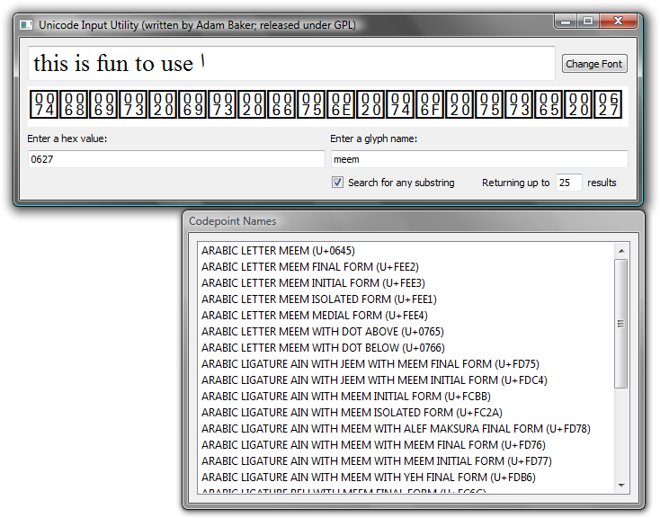

Unicode Input Utility
------------

If you know from a glance what this is, you must be very excited.



Instructions
------------

*   The top line is a text edit box with normally rendered Unicode text. You can type into that box, using whatever (virtual) keyboard you wish. You can change the display font.
*   The second line shows the actual Unicode codepoints for the text that you entered. Missing glyph? Zero-width space? All are visible in this view, with their hexidecimal values plain to see (though see below). Whenever the top line changes, this view changes as well.
*   In the “Enter a hex value” box, you can enter a hexadecimal value, hit Enter/Return, and that character (codepoint) will appear wherever you left your cursor in the top box.
*   In the “Enter a glyph name” box you can search for a glyph name from the Unicode 8.0 specification. Double-click on that glyph name, and the glyph will appear where the cursor is in the top box. The default is to search for all names beginning with the string you entered, but you can also search for any name containing the substring (shown).
*   _Nov. 28, 2010 Update_
    *   If you type a codepoint into the “Enter a hex value” box, the name of the codepoint will be displayed below. (Handy for learning the names of the codepoints.)
*   _Dec. 8, 2010 Update_
    *   Now hex values can be entered from outside of the Basic Multilingual Plane (beyond the 16-bit limit). The unicode values will not be shown properly in the window, though.
*   _May 7, 2011 Update_
    *   Bug fix: previously selecting a codepoint from the search results from outside the Basic Multilingual Plane did not work.
    *   There is now an option (checked by default) to sort search results by codepoint, which is often the way you want to do it.
*   _October 3, 2011 Update_
    *   The codepoint window now shows multicharacter selections, as well as cursor position.
    *   Placing the cursor over a codepoint will now produce the Unicode name of the codepoint in a tool tip.
    *   The “Unicode BMP Fallback SIL” font is no longer required.
    *   Codepoints outside of the BMP are now displayed correctly.
*   _June 30, 2015 Update_
    *   The database has been updated to Unicode 8.0—it was previously 5.1.
    *   Worked around a Qt bug that prevented the zero-width non-joiner (0x200C) from being typed.

Known issue(s)
------------

*   When you edit diacritics, you are limited in the typically text-editing way. You can only Backspace over the last diacritic added, for instance. This should be a familiar restriction from word processing applications.

Downloads
---------

Unicode Input Utility is created with the [Qt application framework](https://www.qt.io/), released under the GNU Public License. That means, among other things, that you are free to download it and use it, but not to re-sell it.

Qt is a cross-platform framework, so there is the possibility for using this on Mac OS X, Linux, etc. Right now I only have Windows executables because I only have a Windows machine. Perhaps some do-gooder will build versions for other operating systems and send them to me.

I build in Windows with this, which assumes that Qt is installed and visible in your path:

```
qmake -config release
mingw32-make
```

Of course your system would have something different from “mingw32-make”—probably just “make”—if you are not building from Windows using MinGW.
